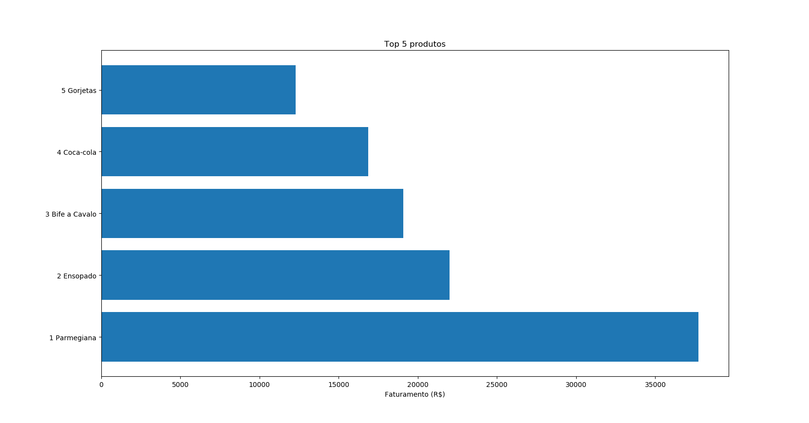
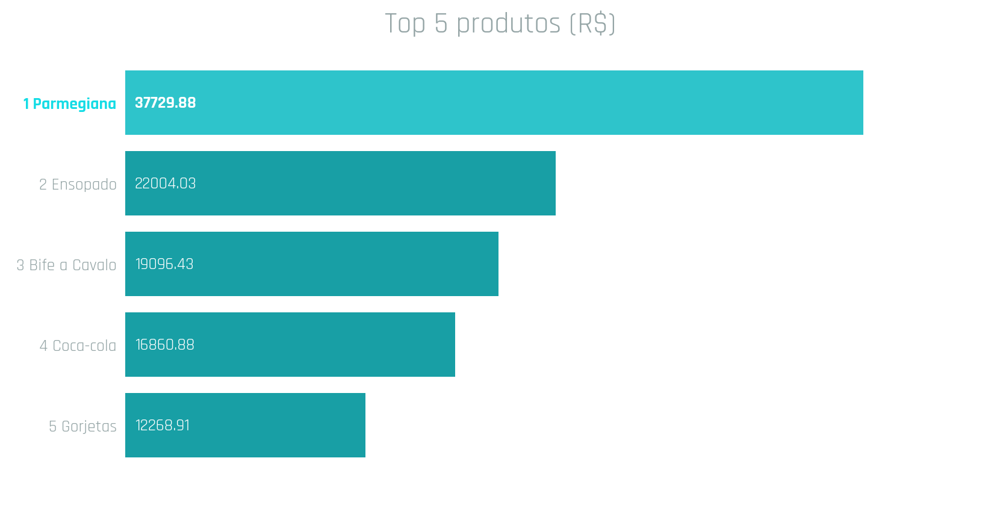

# Comparing python charts, a default chart versus a chart with principles of dataviz

# The Ugly
The chart bellow is default chart with no treatment or design using matplot lib, the code of the chart is on [default_chart.py](default_chart.py):

# The Beauty
The next on is a chart (code is on [beautiful_chart.py](beautiful_chart.py)) using a more appealing python chart lib (seaborn), and with a many different customizations, like: fonts sizes, fonts colors, bar color, label spotlight and others:

 