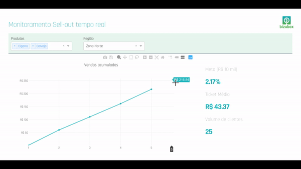

# Real time sell-out monitor prototype
Reall time sell-out Dash app Dash abstracts away all of the technologies and protocols required to build an interactive web-based application and is a simple and effective way to bind a user interface around your Python code. This app can be used to to update the sales volume data every second. Check the app.py file to see the code used to build this app.

This is a prototype using Dash interactive Python framework developed by Plotly.

bizubox lab: Some codes, some ideas, somo explorations by bizubox =)